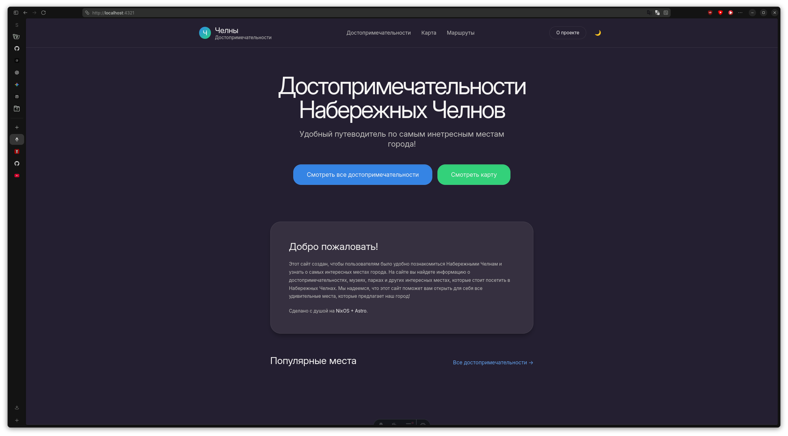
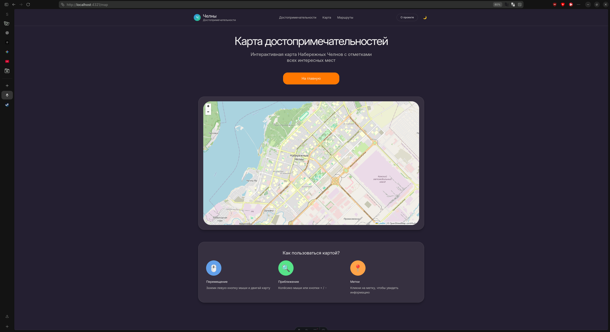

# 📜 CHANGELOG 😸

Все изменения проекта «Достопримечательности Набережных Челнов».

Формат: **[версия]** — **дата** — краткое описание

<details>
<summary>Уточнения в плане обновления</summary>
Оформление будет более деловым в плане описание обновление. А что то эмоциональное будет находиться в `summary` под значками `✨`! Чтобы было и живо но и не засерало тонну строчек моего нытья в обновление! 😆💫

Каждое глобальное обновление будет собираться из прошлых... тоесть раз в 30 день (В 15 числа) будут делать итоги, скриншоты, таблицы и прочие что я найду и научусь в markdown.

</details>

## [0.38.46] - 2026-06-5


### ✨ Добавлено

- В `register.astro`
  - `novalidate` для того чтобы работали `alert`
  - Было добавлено больше проверк для пароля, чтобы он не был простым.

### 📝 Комментарии

Теперь проверка работает отлично! Теперь же надо как то БД и интегрировать его в supabase.

<details>
<summary>✨ Личное... ✨</summary>
Какже это иногда заёбывает. Мотивация уже давно выдохнула... и на чём я держусь это то что проект развивается! И на мысли что будет через год... как видишь по `README` а именно TO DO LIST там... то задач всё больше и больше выпалняются. И проект не сидит на месте что радует! И да... даже как то удивительно что за месяц проект снова расскрылся по новому. 
</details>

## [0.37.45] - 2026-06-4


### ✨ Добавлено

- `console.log` в `register.astro` чтобы при случае ошибок можно было видеть их.
- Страничка с успешной регесттраций внутри `register.astro`.

### 🐛 Исправлено

- Теперь формы проверяют наличе их... и прочие фунуций. Если нету по какой то причине будут жаловаться в терминале.

### 📝 Комментарии

Надо исправить пару проверок в `register.astro`, а то он их по какой то причне не проверяет...

<details>
<summary>✨ Личное... ✨</summary>
Ну на самом делел всё с каждым разом тяжелее и тяжелее делать проект... не прям пипец скорее как... я бы хотел в CSS возица... а... смысл? Типа если буду это делать то проект просто застопирится и ВСЁ! Так что... не жалуюсь просто скажем так крик души. 😆
</details>

## 0.36.44 - 2026-06-3 - СНОВА ЛЕНЬ


### ✨ Добавлено

- Задачи в change.log на завтра. И переделан `register.astro` (Спойлер: Не обращайте внимание на это... я поныл... но всё же исправил... надо было исправить в lib `supavase.ts` по новому стандарту!)
- Добавлена заглушка `confirm.astro`! Ну она просто дублирует от `register.astro`!

### 🗒️ Комментарии

Что опять? Да когда я посмотрел в терминале то написала та самая ошибка... что у меня `.env` не исправный... и вот тогда у меня опять опустились руки... так что хотя бы надо что то сделать... по итоги всё равно сделал... так что... ну НОЕМ И ДЕЛАЕМ(Нечего нового)! 🫱😺🔨

## 0.36.43 - 2026-06-2 - КОСМЕТИЧЕСКОЕ


### ✨ Добавлено

- В `Header.astro` были добавлен иконка `👤` и при наведние лёгкий наклон! (В будщем надо добавить в отдельно в `components`!).

### 🗒️ Комментарии

Пока что знаешь? Желание пред упало... а делать надо! Так что вот постепенно делаю! Может быть это из за того что до этого я делал больше часа? Кто его знает! 🔨😺🎧

## 0.36.42 - 2026-06-1 - РАЗБОР!


### ✨ Добавлено

- В `supabase.ts` проверку наличия `.env` файла.

### 🗒️ Комментарии

Ну чтож... теперь легче! Да с первых парах это тяжело... но потом как обычно втягиваешся! Разбираешь код строчкой за строчкой и... это **✨ПРИЯТНО✨**! Так что... как обычно трагедий не было. 😅🫱😺

## 0.35.41 - 2026-05-31


### 🐛 Исправлено

- Подправил стили в регистраций и заменил кнопку `О проекте` на `Аккаунт` (В будущем заменю).

### 🗒️ Комментарии

Ну привет! Что то с `grok` серваками упали... и падают постоянно... так что чтобы не терять времени я решил просто исрпавить то что я хорошо умею всегда... править стили! 🖌️😺🎓

## 0.35.40 - 2026-05-30 - Пора разбор!


### 🐛 Исправлено

- Поставлен правильный ключ! (Точнее API ключ в базу данных)

### 🗒️ Комментарии

Ну вот и всё! Наверное следующие дни я буду разбирать код и коментировать что там да как делает... и читать доку. Почему? А если у меня упадёт он то что мне делать то? ИИ то помочь то может... а если не поможет? Лучше заранее подготовиться! 🏗️🚧⛑️😺

## 0.34.39 - 2026-05-29 - ЛЕНЬ


### ✨ Добавлено

- Были установлены `@supabase/ssr` `@supabase/supabase-js`

### 🐛 Исправлено

- Исрпавлен синтаксис в коде чтобы работал. (Но пишет неправильный API).

### 🗒️ Комментарии

Ошибка тут только я... я нихуя не понимаю! Там для меня это как тёмные воды! Короче посмотрим разберусь ли я в этом вашем всё... или нет. 😵‍💫

## [0.33.38] - 2026-05-28 - Проба пера


### ✨ Добавлено

- `register.astro` И `supabase.ts`!

### 🗒️ Комментарии

Ну... вот я попробовал добавить... и надо чинить! Впринципе а что я ожидал? Пока что я пробую supabase! А потом подумаем а стоит ли его после использовать! Короче и сегодня мне лень (Так как до этого я хреначил часами... конечно же!) Так что код я тем более там не понял так что...(Такое чувство будто я сам только ели как склепаю верстку и css файл... и то мне будет нужен интернет...) ВСЁ ПЛОХО! ☁️😭⛈️ (Или нет короч посмотрим.)

## [0.32.37] - 2026-05-27 - ПОЧИНЕНО!


### ✨ Добавлено

- Был добавлен `color-mix`
- Цвета к `border` и за прозрачности теперь сочетаются!

### ♻️ Изменено и 🐛 Исправлено

- Теперь `border` в `global.css` не является глобальным а `@layer` (Что и как раз и мешало при добавление новых цветов!)

### 🗒️ Комментарии

Ну... так уж и было сложно... время потратил 2 часа... мнда... отлично! Хотел на 30 минут а вышло как всегда... 😬. Так что теперь можно с чистой душой наконец приступать к добавления аккаунтов... (ахх... ещё лучше...).

## [0.31.36] - 2026-05-26 - ПРОДОЛЖАЕМ ЛОМАТЬ!


### ♻️ Изменено

- Снесён ПОЛНОСТЬЮ -gnome индификатор... в `.css` файлах. Для будущей меньше путаницы.

### 🚫 Ошибки

- Так как стили были чётко завязаные на -gnome... появилась ошибка с границами! Тоесть `border`!

### 🗒️ Комментарии

Ну... скажем так я ДОВЫЁБЫВАЛСЯ! Я планировал сегодня добавить аккаунт чтобы можно было регестрироваться... а теперь нужно разбираться почему границы тоесть цвета не на всех не применяется! Это не сложно... просто время. 🌧️☔😿

Ну если говорить о хороших новостях то наконец то `.css` с каждым днём становятся всё лучше и лучше... чище... структурирование! Так что... удачи будущего меня! ☁️🌈

## [0.30.35] - 2026-05-25 - Красочный день ПРОДОЛЖАЕТСЯ


### ✨ Добавлено

- ...

### ♻️ Изменено

- Теперь и `index.astro` и немного `themes.css` подключены стили.

### 🐛 Исправлено

- ...

### 🗑️ Удалено

- ...

### 🗒️ Комментарии

Ну... теперь сайт начинает подстравиваться под новые стили! Конечно надо хорошенько подумать как лучше реализовать... но теперь сайт буквально можно менять как хочешь! Тоесть сделать свою тему теперь гораздо легче! (Только конечно кому это кроме меня... только ради `material of you`!) 😸🥓 (И да я бекон не ем... он не полезный 📉😾)

## [0.30.35] - 2026-05-24 - Красочный день


### ✨ Добавлено

- ...

### ♻️ Изменено

- ВЕСЬ `themes.css`!

### 🐛 Исправлено

- ...

### 🗑️ Удалено

- ...

### 🗒️ Комментарии

Я изменил весь... **БОЛЬШУЮ ЧАСТЬ** (Ещё требуют скажем так и доработок и в `global.css`) в `themes.css` так как я хочу добавить в будущем... `Material of you` на основе фот достопримечательностей... а это потребуют гибких тем что я и сделал! Теперь там не просто `--color-gnome-blue`, а прям полноценое от `--color-gnome-blue-50` до `--color-gnome-blue-950`! Теперь шаг в сторону `catpuchine` подхода реализован! 🌅😸🎊

## [0.30.34] - 2026-05-23


### ✨ Добавлено

- ...

### ♻️ Изменено

- Теперь функция `id="theme-toogle"` замененая на `class="theme-toggle-btn"` Для того чтобы вешать на несколько а не только на один! (И да мне придётся ещё раз разбирать что там у меня с js теперь 😿💦)

### 🐛 Исправлено

- Теперь анимация накладывается на всё! (Пока что... это надо ещё оптимизировать!)

### 🗑️ Удалено

- ...

### 🗒️ Комментарии

Ну... что могу сказать? Я хотел использовать чисто gnome цвета... а по итогу... мне видимо ещё придётся создавать все новые цвета но уже для светлой темы! Чтобы это выглядило органично! (Даже если все всё равно будут сидеть на тёмной 😾💢) Так что думаю... может создать даже в честь этого отдельную тему в github? Как в `catpuchine`? Кто его знает... может когда то руки и дойдут! 🫟😸🎨

## [0.29.33] - 2026-05-22


### ✨ Добавлено

- Теперь уже подерживает фуекцию смена темы в `Header.astro`! И добавленые в `Layout.astro` тригер `is::inline` чтобы подлавить и отрисовать светлую тему была выбрана или тёмная. 🌗✨

### ♻️ Изменено

- Были немного смегчены цвета у светлой темы! Теперь она будет выглядеть более мягко и приятно для глаз! 🌞✨

### 🐛 Исправлено

- ...

### 🗑️ Удалено

- ...

### 🗒️ Комментарии

Руки наконец дошли доделать эту кнопку в `Header.astro`! И уже да... постепенно начали так скажем добавлять `JavaScript`, который пока что я не разбераюсь... но буду изучать по ходу событий! 🎄😼 (Да! ёлка под угрозой!)

## [0.28.32] - 2026-05-21


### ✨ Добавлено

- Светлая тема в `themes.css`

### ♻️ Изменено

- ...

### 🐛 Исправлено

- ...

### 🗑️ Удалено

- ...

### 🗒️ Комментарии

**ЛЕНЬ!** Одним словом... а так? У меня за сегодня желание делать это не хочется... мне ещё и rust rover делать так что... короче ну супер день 😫☕ (И да... я кофе не пью.)

## [0.28.31] - 2026-05-20


### ✨ Добавлено

- Новые классы в global.css и вынесен border как отдельный класс `utility`.

### ♻️ Изменено

- ...

### 🐛 Исправлено

- ...

### 🗑️ Удалено

- ...

### 🗒️ Комментарии

Ну... немного... хотя НЕ НЕМНОГО... рассортировал и добавил границы в `map.asrto` к информаций под картой... я ещё думаю стоит ли оставлять... но пока что оставил! (Спойлер: Удалил так как я считаю что текст должен быть без границы.)

## [0.27.30] - 2026-05-19


### ✨ Добавлено

- Больше `md:`! А значит наконец интрефейс на телефоне выглядит... удоборимо! 😬👍 (Ну так как дизайн на пк мне больше нравится!)

### ♻️ Изменено

- ...

### 🐛 Исправлено

- ...

### 🗑️ Удалено

- ...

### 🗒️ Комментарии

Ну наконец я починил мобильные версию! Мне лень что то делать сегодня так что обновление... КОРОТКОЕ! 💤

## [0.26.29] - 2026-05-18


### ✨ Добавлено

- В `header.astro` были добавлены `menu-toggle` и `mobile-menu` и НАКОНЕЦ ТО... первый скрипты на js... которые просто при нажатий запускают анимацию открытия и закрытия.

### ♻️ Изменено

- ...

### 🐛 Исправлено

- ...

### 🗑️ Удалено

- ...

### 🗒️ Комментарии

Честно? Придётся почистить header.astro от классов tailwind перенеся их в `gloval.css`. 🧹

## [0.25.28] - 2026-05-17


### ✨ Добавлено

- `Footer.astro` в components! Теперь сайт будет использовать этот компонент для отображения нижнего колонтитула, что обеспечит единый стиль и удобство использования! 🏁✨

### ♻️ Изменено

- Теперь body в `global.css` использует flex и flex column, а в main добавлен flex 1! Теперь сайт будет использовать flexbox для организации контента, что обеспечит более гибкую и адаптивную верстку! 🧩✨

### 🐛 Исправлено

- ...

### 🗑️ Удалено

- ...

### 🗒️ Комментарии

Я увидел что в firefox есть функций f12... Я до этого пользовался но вот прям когда я начал изучать... понял что большинство функций либо не работают в css... так что на следующих днях я планирую либо почистить... либо исправить! 😺🔧

## [0.24.27] - 2026-05-16


### ✨ Добавлено

- Уточнения как применять анимацию в `README.md`
- В global.css `background-item`.

### ♻️ Изменено

- ...

### 🐛 Исправлено

- ...

### 🗑️ Удалено

- ...

### 🗒️ Комментарии

Думаю в плане созданий более проработаных анимаций.

## [0.23.26] - 2026-05-15





### ✨ Добавлено

- Карта в `Map.astro`!

### ♻️ Изменено

- Дизайн `Map.astro` и код в `Map.tsx`!

### 🐛 Исправлено

- ...

### 🗑️ Удалено

- ...

### 🗒️ Комментарии

Предстоит вынести `footer` в component чтобы не добавлять лишний раз в странице. Ещё стоит как следенько разобраться в `Map.tsx`... а то пока что я нечерта не понимая до конца и врядли смогу сам это написать...

---

## 0.22.25 - 2026-05-14

[CSS и дизайн]
[Добавление папок]

- Добавлен анимация в global.css `adwaita-button-external` теперь сылки будут указывать стрелкой вверх!
- Добавлены `shield` в readme для красоты! 🛡️✨
- Добавлены в `src/assets` папки `icons` и `images` для хранения иконок и изображений! 🖼️📁
- Добавлены под категорий папок в `images` такие как `backgrounds`, `changelog` (ну то что будет входить в сюда как демонстрация изменений) и `attractions` (для изображений достопримечательностей)! Теперь все изображения будут организованы по категориям, что упростит их поиск и использование! 🗂️✨

## [0.21.24] - 2026-05-13

- Добавлены `.adwaita-button-in/out:hover` и `CHANGELOG.md`! 🗓️
- Больше параметров в themes для управление всего и вся. ⚙️

## [0.20.23] - 2026-05-11

- Добавлен компонент `Header.astro`
- Выделен `themes.css` из `global.css`
- Убрана ненужная структура проекта

## [0.19.22] - 2026-05-10

- Чистка кода и комментарии

## [0.18.20] - 2026-05-08

### Дизайнерское обновление

- Определены основные цвета и шрифты
- Большая часть стилей перенесена в `global.css`
- ...

# Старый тип прописание обновлений ниже

### Обновления 0.20.23 -11.5.26-

- Был наконец написан Header.astro так что теперь если надо будет добавить header это указывается простым <header>! И добавлено в index.astro! Теперь сайт будет использовать этот компонент для отображения заголовков, что обеспечит единый стиль и удобство использования! 🏁✨
- В global.css было отдельно выводен themes! 🌑🌞
- Был убран структура проекта из за не надобности! 🧹✨

### Обновление 0.19.22 -10.5.26- === Чистка ===

- Простая чистка, немного добавление комментариев и определены следующие цели.

### Обновление 0.19.21 -9.5.26-

- Было чуточку изучено tailwind css wiki! И в index.astro было лишь добавлено _box-decoration-slice bg-gnome-blue px-2 rounded-2xl_! Теперь сайт будет использовать эти стили для создания эффекта обрезки фона и добавления отступов и закруглений к элементам! 🎨✨

## Обновление 0.18.20 -8.5.26- **=== ДИЗАЙНЕРСКОЕ ===**

Если подводить итоги по всем этим обновлениям... За всё время сайт превратился в CSS (Ну так как css больше чем astro!) И по крайне мере я останавливать в дизайне не собираюсь! Вот какие итоги у нас вышли: 🏁

- Определины главные цвета прокекта и добавлены в global.css!
- Определины главные шрифты.
- Большинство стилей хранится в global.css и будут храниться до самого конца проекта как NixOS! А разметку, размер шрифта, отступы и цвета будут храниться в index.astro
- Взят отдельный typography из другого github сайта.
- И немного анимаций!

Так что последущие обновления будут сосредоточены на более точеченый стиль, больше анимаций, современного подхода например блюр и зернистости фона. ⛰️✨

### Обновления 0.17.19 -7.5.26-

- Добавлены заготовка как map.tsx и Leaflet! И начала создания страницы map.astro! Теперь на сайте будет интерактивная карта, которая позволит пользователям легко находить достопримечательности и ориентироваться в городе! 🗺️📍

### Обновления 0.16.18 -29.4.26-

- Был чуточку отредакктирован global.css сделав закругление больше, в index.astro было большо дабавлено свободного места, добавлены md и попытка адаптировать под мобильные устройства! Теперь сайт будет выглядеть более современно и будет удобен для просмотра на мобильных устройствах! 📱✨

### Обновления 0.15.17 -28.4.26-

- Было убран в hero секцйи adwaita-card и увеличин текст h1 побольше! Теперь главная секция будет выглядеть более ярко и привлекательно, а текст будет легче читаться! 🌟📢

### Обновления 0.14.16 -27.4.26-

- Добавление цветов в typography.css из global.css! Теперь сайт будет использовать эти цвета для оформления Markdown контента, что придаст ему более приятный и читаемый вид! 🖌️✨

### Обновления 0.13.15 -26.4.26-

- В typography.css были добавлены (пока что как заготовка от другого сайта) стили для заголовков, параграфов, списков и других элементов Markdown! Теперь сайт будет использовать эти стили для оформления Markdown контента, что придаст ему более приятный и читаемый вид! 🖌️✨

### Обновления 0.12.14 -25.4.26-

- В gloval.css был добавлен tailwind-scrollbar-hide/v4 и добавлен typography.css(пустышка) для того чтобы в будущем добавить стили для Markdown! Теперь сайт будет использовать эти стили для скрытия полос прокрутки и для оформления Markdown контента! 🖌️✨

### ОБновления 0.11.13 -24.4.26-

- Главный стили такие как фон и кнопки перенесены в global.css! Теперь все стили будут храниться в одном месте, что упростит их управление и настройку! 🖌️🎨🐱✨

### Обновления 0.10.12 -23.4.26-

- Были добавлены больше стилей в index.astro немного! 🍦🐈‍⬛
- Был удалён tailwind.config.mjs и все стили перенесены в global.css! Теперь все стили будут храниться в одном месте, что упростит их управление и настройку! 🎨✨

### Обновления 0.9.11 -22.4.26-

- В global css были добавлены шрифты! И заливка фона! В index.astro было добавлено main и добавлены такие строчки _смотреть ниже_.

```
max-w-5xl //Макс ширина для контента
mx-auto //внешние отступы по горизонтали
py-8 // внутри отступы по вертикали
px-4 // и по горизонтали
space-y-8 // расстояние между элементами по вертикали
```

### Обновления 0.8.10 -21.4.26-

- В index были чуточку добавлены больше стилей! Таких как tracking-tight, max-w-md, flex-col, sm:flex-row, transition-all, active:scale-95 shadow-inner! Все они придают сайту более современный и приятный вид, а также улучшают взаимодействие с пользователем! ✨🎨

### Обновления 0.7.9 -_20.4.26_-

- Были замененны цвета в index на --color-gnome из global.css! Теперь сайт будет использовать цвета из глобальных стилей, что обеспечит единый стиль и легкую настройку цветовой палитры! 🎨✨

### Обновеления 0.6.8 -_19.4.26_-

- Было отредактирован content.config.ts всё важное для создания достопримечательности! Теперь можно легко добавлять новые достопримечательности просто создавая новые Markdown файлы в папке src/content/attractions и используя шаблон \_template.md! 📝✨
- Было отредактировано astro.config.mjs ищменено markdown стиль на тёмную, прдезагрузку страниц и панель разработчиков dev tools! Теперь сайт будет использовать тёмную тему для Markdown, а также будет поддерживать прдезагрузку страниц и панель разработчиков dev tools! 🌑🔧

### Обновеления 0.5.7 -_18.4.26_-

- Добавлены папка fonts в public и добавлены шрифты Adwaita Sans и JetBrains Mono! Теперь сайт будет использовать эти шрифты, если они доступны в системе, иначе - запасные варианты 'system-ui' или 'sans-serif'. 🖋️😺
- Добавлены content.config.ts (Черновой вариант так как внутри **ПУСТО!** Также как и внутри файлы pages/attractions/! 🕳) где указано что контент для достопримечательностей будет в папке src/content/attractions и будет использовать шаблон \_template.md! Теперь можно легко добавлять новые достопримечательности просто создавая новые Markdown файлы в этой папке! 📝✨
- Добавлено в pages/attractions/index.astro и [slug].astro где index.astro будет отображать список всех достопримечательностей, а [slug].astro будет отображать подробную информацию о каждой достопримечательности! Теперь можно легко просматривать все достопримечательности и их детали! 🌆📍

### Обновеления 0.4.6 -_17.4.26_-

- Обновлено список как проходя обновления! Рание этапы теперь надо смотреть в коммиты! 🐈‍⬛
- Используется системный шрифт **Adwaita Sans** (как в GNOME)! Только если он есть в системе, иначе - запасной вариант 'system-ui' или 'sans-serif'. 🖋️😺
- Был добавлен tailwind.config.mjs где и были указны шрифты и закругление! ✨🎨

### Обновеления 0.3.5 -_16.4.26_-

- В index были добавлены секция "Основные стили и цветовая палитра"! 🔨😸
- Сам index был добавлены ✨**стили**✨!
<!-- Старые обновления ниже ↓ -->
