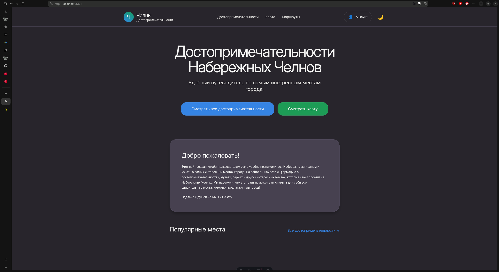

# 🌆 Достопримечательности Набережных Челнов

<p align="center">
  
</p>

<p align="center">
  
  
  
  
  
  
</p>

> Интерактивный путеводитель по достопримечательностям Набережных Челнов.
>
> Быстрый, адаптивный и сделанный в стиле GNOME/Adwaita.

## ✨ Особенности проекта

- **🎨 Эстетика GNOME/Adwaita** и в будущем **Material of you**.
- **🌓 Истинная темная и светлая темы**: Динамическое переключение цветовых схем без мерцания при загрузке.
- 🧱 **Структура папок и файлов**: Использован базововая структура папок Astro.
- **⚡ Молниеносный отклик**: Использование преимуществ Astro 6 и Tailwind CSS для достижения максимальной производительности (Core Web Vitals).
- 🤖 **Современые инструменты**.

## 🛠️ Технический стек

| Компонент   | Выбор                        | Зачем                                           |
| ----------- | ---------------------------- | ----------------------------------------------- |
| Фреймворк   | Astro 6                      | Быстрая генерация страниц и гибридный рендеринг |
| Язык        | TypeScript                   | Меньше глупых ошибок, больше контроля           |
| UI          | React                        | Для интерактивных компонентов                   |
| Стили       | Tailwind CSS + CSS variables | Удобная и единая система оформления             |
| Карта       | MapLibre GL                  | Лёгкая и быстрая карта                          |
| База данных | Supabase                     | Auth, данные и сессии                           |
| Контент     | Astro Content Collections    | Удобная работа с Markdown                       |

## 🚀 Установка и запуск

```bash
# 1. Клонируем
git clone https://github.com/Kostr2007/Sait-Alldostropomichatelnosti.git
cd Sait-Alldostropomichatelnosti

# 2. Устанавливаем зависимости
npm install

# 3. Запускаем dev-сервер
npm run dev
```

## 😺🖌 Основные стили и цветовая палитра



Подробно можно будет изучить в **[Documentation-design.md](docs/DOCUMENTATION-DESIGN.md)**.

- Использовать только **чётные значения** для отсупов и размеров.
- Цвета берутся только из `themes.css`. Если надо добавить цвета то создаваите отдельную тему для этого!
- Анимации только там, где есть действие: `hover, click, transition`.
- Без кучу эффектов и визуального шума! Сайт придерживается минимализма и простоты!

## 🧑‍💻🐈 Дорожная карта

- [x] Изучать Tailwindcss и адаптировать дизайн!
- [x] Добавить шрифты в проект Adwaita Sans и JetBrains Mono!
- [x] Найти ревернс сайтов как вдохновение.
- [x] Сделать кнопки показывающи за счёт закругление(например если закругление только справа, переход, слева? Назад! Сверху? Из интернета и так далее!)... что сайт переходит на другую страницу или активирует что то в этой страницу! И добавить анимацию при нажатии!
- [x] Сделать footer в отдельном astro чтобы было везде одинаковый footer и легко было менять его! И добавить в него ссылки на соц сети и контакты!
- [x] Вынести в README категорию обновления в другой .md файле и ссылаться на него! Чтобы лицо RADME было чище!
- [x] Доделать map.astro. И добавить карту там.
- [x] Вынести footer в components.
- [x] Разобраться с проблемой в мобильной приложений с прокрутокой (так как там отступ).
- [x] Почистить классы в `header.astro`.
- [x] Добавить три полоски для подержки мобильного меню!
- [x] Рассортировать `.css` файлы.
- [x] Исправить ошибку со границами. (Проблема: Нельзя редактировать цвет в themes. Но при смене темы он меняет цвет! И почему смена тема... привязан цвет границ... на цвет **ТЕКСТА**)
- [x] Добавить функций добавление аккаунта. (supabase.com)
  - [x] Исправить `.env` файл на проверку, и исправить вывод зарегестрированного аккаунта.
- [ ] Сделать полноценый профиль аккаунта.
  - [ ] Создать полноценый отдельную строничку аккаунта(профиль).
    - [x] Создать верхню часть
    - [ ] Сделать среднию часть (инофрмацию, имя).
    - [ ] Настроить с бд.
  - [ ] Привезать `supabase` при регестраций в этот профиль.
  - [ ] Сделать так чтобы при выходе он сохронял пользователя.
- [ ] Добавить градиентов и проработку теней, фона.

## 🤔 Как вносить изменения в проект?

- Использовайте эмодзи в умереных количествах! 1-3 эмодзи в заголовках, в тексте добавляйте в конце текста.
- Используйте понятные коммиты. Если хотите добавить эмоций пишете либо в конце коммита или же в описание коммита! Например: `feat: Добавить новый компонент для отображения достопримечательностей 🏰✨`.
- Перед отправкой проверьте что стили сайта сохранёны и не нарушены! Содержащие коментарий кода для других разработчиков.
- Не изменяйте файл `README.md`! Для этого есть `CHANGELOG.md` а если вам нужно добавить что то в `README.md` то создайте отдельный файл и ссылаться на него! Например `DOCUMENTATION-DESIGN.md` для дизайна и так далее! Чтобы лицо README было чище!
- Когда будете писать в `CHANGELOG.md` что вы сделали и если вы хотите добавить эмоций... то пишете в `summarry` под именем `📝 Дневник разработчика`!

# 🥽😺 Обновления

Полный список обновлений смотреть в **[CHANGELOG.md](CHANGELOG.md)** 😺

## ✨📈 Поясние как работают обновление

- **Мажорная версия (1.x.x)**: Глобальный архитектурный передел, крупные релизные вехи развития путеводителя. 📈
- **Минорная версия (x.1.x)**: Инженерные изменения, непосредственное написание функционального кода, интеграция баз данных и новых разделов. 📃🐈
- **Патч-версия (x.x.1)**: Косметические правки интерфейса, стилей, комментарии к коду и регулярные обновления документации. ✍️🐱

## 🧑‍🎨🐈 Полезные сайты для этого сайта

- [Отдельные части компонентов. 🧱](https://stacksorted.com/buttons)
- [Портфолио дизайнеров. 💼](https://www.portfoliogallery.dev/)
- [Соверменые сайты! 🪩](https://web3inspiration.com/)
